# SDCND06_Control_and_Trajectory_Tracking

 Project 6 of Udacity's "Self-Driving Car Engineer" Nanodegree Program about control and trajectory tracking for automomous vehicles using PID controllers. This repository contains the full code required to run the simulation on Udacity's student environment. It is derived from Udacity's starter code, which you can find in this [repository](https://github.com/udacity/nd013-c6-control-starter.git). 

## Proportional-Integral-Derivative (PID) Control for Vehicle Trajectory Tracking

This project focuses on setting up PID controllers to perform 2D vehicle trajectory tracking in a 3D simulation environment using [Carla](https://carla.org/). The goal is to implement, parameterize and test two independent, decoupled PID controllers for longitudinal and lateral motion control of an ego vehicle driving on flat ground. Given a 2D trajectory as an array of target locations and an array of desired target velocities for each location, which is generated by a behavior and trajectory planner, the two PID controllers are supposed to track the desired target velocities along the given trajectory (longitudinal controller) and keep the lateral deviation of the vehicle position from the desired trajectory (lateral controller) as small as possible. Finally, the implementation of the parameterized PID controllers is tested in a given 3D simulation scenario, s. fig. 1.

[](experiments/screenshots/carla_simulation_scenario_for_trajectory_tracking.png) 
  
*Fig 1: Screenshot of the CARLA simulation scenario showing an ego vehicle following a multi-lane road with some obstacles. The planned trajectories are shown in different colors, where green color indicates the chosen collision-free trajectory, blue color indicates collision-free alternative trajectories with higher cost and red color indicates forbidden trajectories resulting in a potential collision.*  

### Set up

####  Installation
Open a terminal window and go to your basic workspace directory:

```cd /home/workspace/```

Clone the following repository:

```git clone https://github.com/AndiA76/SDCND06_Control_and_Trajectory_Tracking.git```

#### Run Carla simulator

Open new terminal window and get sudo rights:

* `su - student`

Will say permission denied, ignore the warning and continue starting the simulation engine:

* `cd /opt/carla-simulator/`
* `SDL_VIDEODRIVER=offscreen ./CarlaUE4.sh -opengl`

#### Compile the controller code

Go to the project directory:

* `cd SDCND06_Control_and_Trajectory_Tracking/project`

A virtual environment called `venv` is automatically activated.

Install all required packages into this virtual environment:

* `./install-ubuntu.sh`

Go to the pid_controller directory and replace rpclib if needed at all:

* `cd pid_controller/`
* `rm -rf rpclib`
* `git clone https://github.com/rpclib/rpclib.git`

Compile the C++ code:

* `cmake .`
* `make`

In case you encounter the following error:

```
/home/workspace/SDCND06_Control_and_Trajectory_Tracking/project/pid_controller/main.cpp:5210: fatal error: uWS/uWS.h: No such file or directory
#include <uWS/uWS.h>
compilation terminated.
```

uWebSocktets is not installed (ref.: https://github.com/udacity/CarND-Path-Planning-Project/blob/master/install-ubuntu.sh).

In this case, follow below instructions to install uWebSockets:

* `sudo apt-get install libuv1-dev libssl-dev libz-dev`
* `git clone https://github.com/uWebSockets/uWebSockets`
* `cd uWebSockets`
* `git checkout e94b6e1`
* `mkdir build`
* `cd build`
* `cmake ..`
* `make`
* `sudo make install`
* `sudo ln -s /usr/lib64/libuWS.so /usr/lib/libuWS.so #Important, link libuWS.so`
* `sudo rm -r uWebSockets`

#### Run a control and trajectory tracking simulation

Go back to the project directory to run a simulation using the following commands:

* `cd SDCND06_Control_and_Trajectory_Tracking/project`

Run a simulation:

* `./run_main_pid.sh`

The first time this command will silently fail. Please press `ctrl + C` to stop:

* `./run_main_pid.sh` (run it again)

Go to desktop mode to see CARLA:

If error bind is already in use, or address already being used:

* `ps -aux | grep carla`
* `kill id`

#### Plot the test results

The simulation results of both throttle control and steer control are stored in csv format in txt-files:

* `throttle_pid_data.txt`
* `steer_pid_data.txt`

You can plot the results using:

* `python3 plot_pid.py`

Therefore, you need to install additional python modules into the virtual environment:

* `pip3 install pandas`
* `pip3 install matplotlib`

### Step 1: Implementat a PID controller class

You can find both definition and implementation of a generic `PID` controller class in the following files:

* `/project/pid_controller/pid_controller.h`
* `/project/pid_controller/pid_controller.cpp`

Behavior and trajectory planning and motion control cycle are implemented in the `main.cpp` file. The initialization and parameterization of longitudinal and lateral PID controller also happens in this file:

* `/project/pid_controller/main.h`

The simulation is set up and controlled using the python API interface to CARLA, which implemented in `simulatorAPI.py` in the `/project` directory. The communication between the main control cycle and CARAL's simulation API is realized using uWebSockets connection.

### Step 2: Implement a PID controller for longitudinal motion control (throttle control)

In this implementation we use an approach of two decoupled PID controllers to solve the longitudinal and lateral trajectory tracking and motion control task, which is a simple but not an ideal solution.

The dynamic hehavior of a vehicle in longitudinal direction can be roughly approximated by a linear [PT1 element](https://de.wikipedia.org/wiki/PT1-Glied) where the inertia of the vehicle is the dominant cause for the main time constant of the PT1 element. A PID controller is a suitable choice for such a system. Therefore, an instance of the `PID`class is set up in `main.cpp` for velocity control, or throttle control, respectively. It tries to minimize the velocity control error, which is the difference between the desired velocity (velocity setpoint) and the actual velocity.

`velocity_error = velocity_setpoint - velocity`

The output of the PID throttle controller is bound to the output limits [-1, 1] and saturates if the output of an unlimited PID controller would exceed these limits. The output signal of throttle control is split into a throttle actuation signal using the positive part of the control output > 0 and a brake output signal using the absolute value of the negative part of the control output <= 0. These two signals are then fed to the throttle actuator and the brake actuator, respectively. 

### Step 3: PID controller for lateral motion control (steer control)

The kinematic behavior of a typical 4-wheeled vehicle can be approximated by a so-called [bicycle model (Ackermann model)](https://thomasfermi.github.io/Algorithms-for-Automated-Driving/Control/BicycleModel.html), which is non-linear and prone to strong oscillations if control actuation is not applied appropriately. Hence, the dynamic lateral vehicle control behavior is non-linear, too, and what is more, depends on the speed. Higher speeds reduce time constants and require quicker steering reactions, but only tolerate small steering actuation amplitudes, whereas slow speeds leave more time for a reactoin and allow larger steering actuation amplitudes. For such systems a PID controller with constant control parameters is not a good choice as it likely causes instabilities or limit cycles. Parameter adaptation would be needed with respect to different velocities, which requires a lot of testing effort. 
Other control algorithms may be a more suitable choice. [Stanley Control](https://www.researchgate.net/publication/265641608_Longitudinal_and_lateral_control_for_autonomous_ground_vehicles) would be a very simple that consideres both heading error and cross-track error. The cross-track error gain can be adapted to the velocity level in order to reduce control actions at higher speed. However, Stanley control requires the front axle center position to be known. Udacity's starter code only provides the vehicle's center position, and after different tries and research on internet I couldn't figure out a straight forward way how to get the correct front axle position for the ego vehicle from CARLA except for a rough estimation based on the box size of the ego vehicle. 
Another alternative would be [Model-Predictive Control (MPC)](https://en.wikipedia.org/wiki/Model_predictive_control), which allows to consider the non-linear, velocity-dependent dynamic behavior of the ego vehicle using the [inner-model-principle](https://www.control.utoronto.ca/~wonham/W.M.Wonham_IMP_20180617.pdf). 

Besides the choice of the control algorithm we also have to choose which control variable(s) to use. This is not as straight forward as for velocity control. For 2D kinematics we should consider both cross-track error and yaw error. The center of the ego vehicle (or one of its front or rear axle center positions) should follow the desired trajectory with only small lateral deviations. At the same time, the orientation of the ego vehicle should map to the tangent of the desired trajectory. In order to simplify the problem I am using only one control variable here - not a mixture. Although results were not satisfactory for me I found controlling on the cross-track error works better than controlling on the pure heading (yaw) error (even when using a lookahead waypoint as a target point to pursue). For pure heading error control I found it even harder to find parameters that would make the controller bring the vehicle back to track if it looses it once. 

The cross-track error (meaning the lateral deviations) can be calculated in different ways. In this simulation I am using the y-coordinate of the closest trajectory point to the ego vehicle's center position (or approximate front axle position) in ego vehicle coordinates as cross-track error. The ego vehicle's center position is provided by the `simulatorAPI` and is passed to the main function in each uWebSocket message. The front axle position is roughly estimated using a guess for the wheelbase. Transforming the desired trajectory into the ego vehicle's moving coordinate system simplifies the problem to obtain the cross-track error with the correct sign. One just has to read the y-coordinate of the closest waypoint on the desired trajectory in the relative ego vehicle coordinate system, for example.

The output of the PID steer controller is bound to some output limits [-1.2, 1.2]. 

### Step 4: Tune the PID control parameters and evaluate the results

#### Working principle of the PID controller

The [Proportional-Integral-Differential (PID) controller](https://en.wikipedia.org/wiki/PID_controller) is the most-widely used standard controller in industry. It does not contain any inner model and uses three gains, namely:
* a proportional gain Kp to proportionally amplify the control error (= control set value - actual control value)
* an integral gain Ki to amplify the integral of the control error
* and a differential gain Kd to amplify the time derivative of the control error
These three amplified control error components are added to the resulting output of the controller. The resulting control output signal should be furthermore limited by a saturation element bounding the output signal to a minimum and maxiumum possible output as any actuator has a limitation of its output magnitude. When we apply a saturation element to limit the control output we also need to prevent the PID controller from [integral windup](https://en.wikipedia.org/wiki/Integral_windup). This happens when the control output overshoots its limits over a longer period of time. In this case a large integral error will be accumulated, which needs to be reduced before the integrator can react normally again. This can lead to a longer lag time before the PID controller finds back to a good working point which often leads to oscillations. Therefore, we also need to implement some anti-windup method that stops the integrator from continuing integration when an integrator / output limit is reached. This reduces delays when the control ouptut falls back into the allowed saturation limits, such that the integral part of the PID controller is at once able to react on further changes. 

#### Tuning the PID control parameters

Tuning the PID controller parameters usually works as follows:
1. The inital integral value is set to a suitable start value (e.g. zero as we start from stillstand without errors).
2. Set all other controller gains to zero.
3. Increase the proportional gain Kp in steps until the system gets instable, then turn it back leaving some stability margin. The resulting setup will leave some remaining offset between the desired and the actual conrol variable.
4. Increase the integral gain Ki gradually until the control error starts decreasing ... ideally converging to zero over time. If we see low-frequent oscillations or limit cycles we need to reduce Ki until we have stability or set it completely to zero. Please watch the limitations of the integrator. Integration stops if a limit is reached.
5. Increase the differential gain Kd to reduce controller reaction time or to dampen overshots to some extend. If increasing Kd leads to high-frequent oscillations we need to reduce it until we see a stable dampened reaction or set it completely to zero.

Remarks:
- A proportional is always needed.
- Step 4 and 5 can be exchanged.
- For some problems we may only need an integral part, for others we may only need a differential part. 

#### Issues with independent, decoupled longitudinal and lateral motion contoller

As mentioned before, tracking 2D trajectories with independent longitudinal and lateral controllers is not an ideal solution as longitudinal and lateral motion are automatically coupled by the given trajectory shape. It actually only works properly when both motion controllers are perfectly tuned to the planned test trajectories and adjusted to one another, too. If one of them does not follow the desired trajectory component well enough, problems will automatically arise which mutually affect the control behavior of the other controller, too. For instance, if the vehicle velocity control is too slow (too quick) and lacks behind (overshoots) the planned velocity trajectory, the lateral controller will likely loose track or becomes instable as it will see an increasing cross-track error. At some point, the gap will be too large to find back to track. It becomes even worse if the behavior planner does not wait for the motion controller either and overtakes it. Unfortunately, this is likely the case in our simulation. This is also the reason why I could not trim the throttle controller too hard as it would easily overtake the planner then. Ideally, we should have a coupling between longitudinal and lateral trajectory tracking considering the natural behavior of our ego vehicle. This can be achieved by Model Predictive Control (MPC). Being able to incorporate the coupled non-linear behavior of our vehicle is probably one of the greatest advantages of MPC over simple PID control. This leaves a lot of room for improvements of this simulation.

#### Test results with different PID control parameters

Table 1a and 1b list some of the parameter combinations I have used for testing longitudinal (throttle) and lateral (steer) motion control using PID controllers in the given simulation scenario. In *test sequence a* I use the yaw error for lateral control. In *test sequence b* I use the cross-track error (cte) with respect to the ego vehicle center point test 1 - 8) or the estimated ego vehicle front axle position (test 9 - 10). The control parameters have been set following roughly above guidelines for adjusting PID control parameters but leaving out some steps to reduce the number of tries and the documentation effort. Table 2a and table 2b show the results, which have been obtained by applying the two decoupled PID controllers for longitudinal (throttle) and lateral (steer) motion control. Knowing that the PID controller design is not ideal for this setup, my goal for parameter tuning was only to get some kind of "decent" results that could halfway stay on track and would not lead to an early crash into one of the obstacles on the way (although this could hardly be prevented). As parameter tuning using CARLA is really tedious I have stopped this procedure at a certain point of time although there might be some better parameter setting and more room for improvements. 

**Test control parameter values**
| Test no. | steer control variable (lookahead) | Kp (steer) | Ki (steer) | Kd (steer) | Kp (throttle) | Ki (throttle) | Kd (throttle) |
|:-:|:-:|:-:|:-:|:-:|:-:|:-:|:-:|
| 1 | yaw error (last waypoint on path segment) | 0.2 | 0.0 | 0.0 | 0.2 | 0.0 | 0.0 |
| 2 | yaw error (last waypoint on path segment) | 0.25 | 0.0 | 0.01 | 0.2 | 0.0 | 0.01 |

*Table 1a: PID control parameters for steer and throttle control using the yaw error for lateral control (using the closest waypoint to the ego vehicle's center position as setpoint)*

| Test no. | steer control variable (lookahead) | Kp (steer) | Ki (steer) | Kd (steer) | Kp (throttle) | Ki (throttle) | Kd (throttle) |
|:-:|:-:|:-:|:-:|:-:|:-:|:-:|:-:|
| 1 | cte (closest waypoint to ego center) | 0.2 | 0.0 | 0.0 | 0.2 | 0.0 | 0.0 |
| 2 | cte (closest waypoint to ego center) | 0.2 | 0.0 | 0.2 | 0.2 | 0.0 | 0.2 |
| 3 | cte (closest waypoint to ego center) | 0.2 | 0.0 | 0.3 | 0.22 | 0.001 | 0.05 |
| 4 | cte (closest waypoint to ego center) | 0.2 | 0.0 | 0.5 | 0.22 | 0.001 | 0.0 |
| 5 | cte (closest waypoint to ego center) | 0.2 | 0.01 | 0.3 | 0.18 | 0.005 | 0.0 |
| 6 | cte (closest waypoint to ego center) | 0.18 | 0.008 | 0.28 | 0.17 | 0.004 | 0.0 |
| 7 | cte (closest waypoint to ego center) | 0.1 | 0.0 | 0.05 | 0.17 | 0.004 | 0.0 |
| 8 | cte (closest waypoint to front axle) | 0.1 | 0.0 | 0.05 | 0.17 | 0.004 | 0.0 |
| 9 | cte (closest waypoint to front axle) | 0.4 | 0.000002 | 0.0 | 0.17 | 0.004 | 0.0 |
| 10 | cte (closest waypoint to front axle) | 0.16 | 0.0 | 0.0 | 0.17 | 0.004 | 0.0 |

*Table 1b: PID control parameters for steer and throttle control using the cross-track error (cte) for lateral control (using the closest waypoint to the ego vehicle's center position as setpoint for tests in tests 1 - 7 and an estimate of the ego vehicle's front axle position assuming a wheelbase of 4.0 m in tests 8 - 10)*

**Plots**

| Test no. | Steer control errors | Throttle control errors | Path cooridates | 2D trajectory |
|:-:|:-:|:-:|:-:|:-:|
| 1 | [](project/experiments/test_yaw_01/figure_1_lateral_control_errors.png) |  [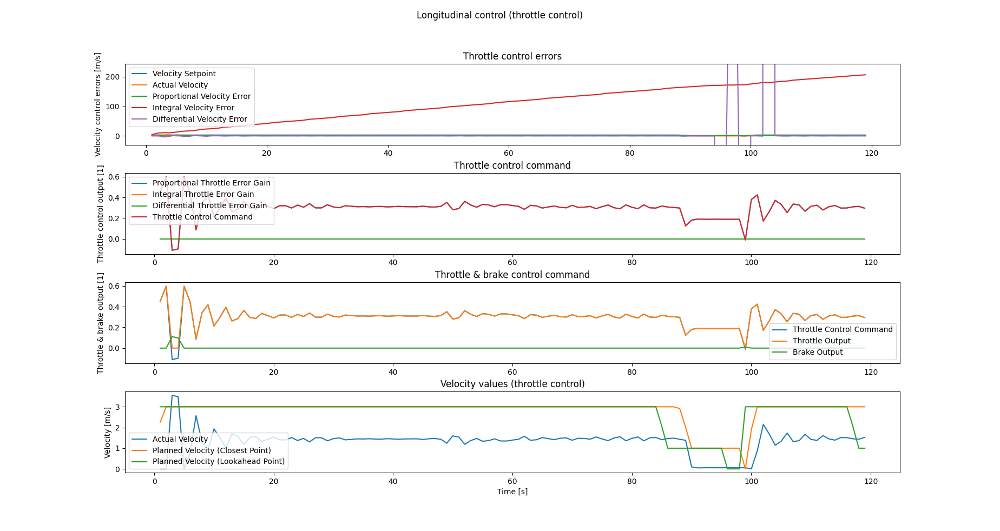](project/experiments/test_yaw_01/figure_2_longitudinal_control_errors.png) | [](project/experiments/test_yaw_01/figure_3_path_coordinates_of_actual_and_planned_trajectories.png) | [](project/experiments/test_yaw_01/figure_4_actual_and_planned_trajectories.png) |
| 2 | [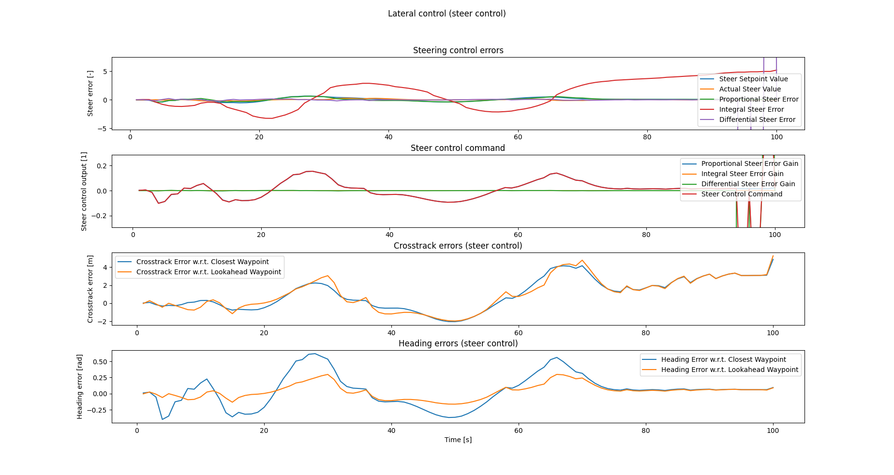](project/experiments/test_yaw_02/figure_1_lateral_control_errors.png) |  [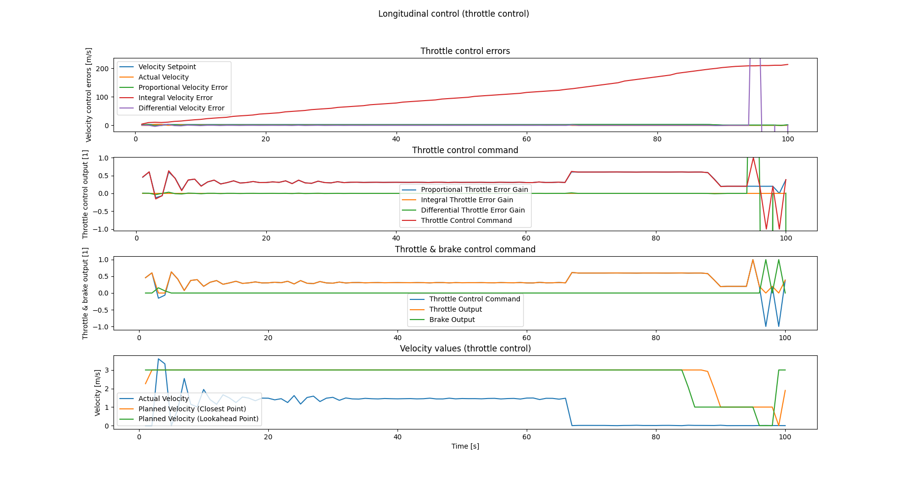](project/experiments/test_yaw_02/figure_2_longitudinal_control_errors.png) | [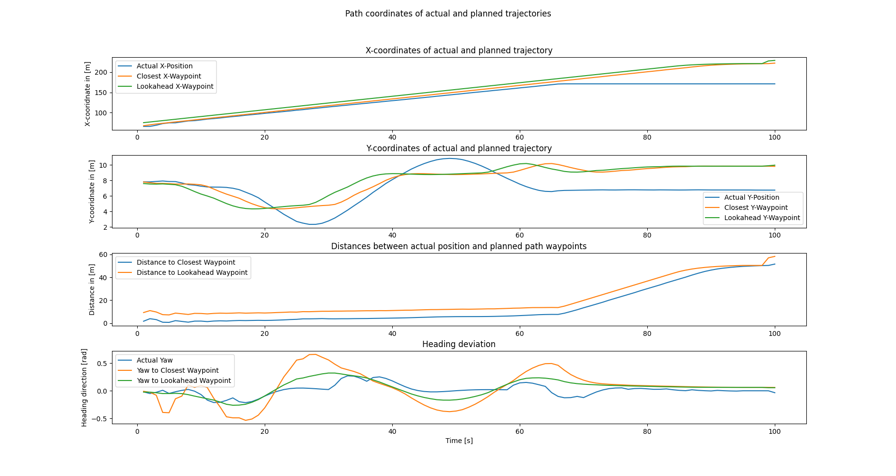](project/experiments/test_yaw_02/figure_3_path_coordinates_of_actual_and_planned_trajectories.png) | [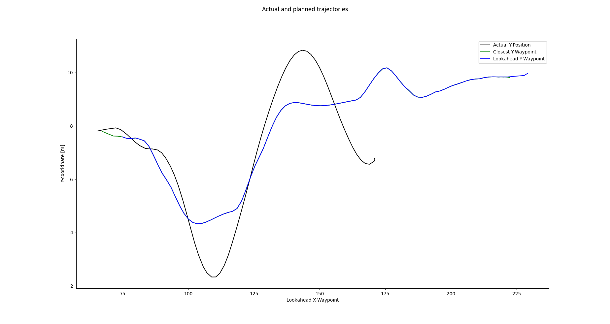](project/experiments/test_yaw_02/figure_4_actual_and_planned_trajectories.png) |

*Table 1a: Results for PID steer and throttle control with parameters from table 1b using yaw error for lateral control (using the closest waypoint to the ego vehicle's center position as setpoint)*

| Test no. | Steer control errors | Throttle control errors | Path cooridates | 2D trajectory |
|:-:|:-:|:-:|:-:|:-:|
| 1 | [](project/experiments/test_cte_01/figure_1_lateral_control_errors.png) |  [](project/experiments/test_cte_01/figure_2_longitudinal_control_errors.png) | [](project/experiments/test_cte_01/figure_3_path_coordinates_of_actual_and_planned_trajectories.png) | [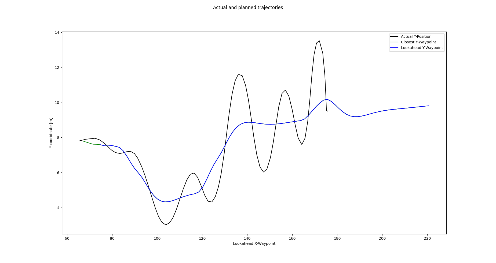](project/experiments/test_cte_01/figure_4_actual_and_planned_trajectories.png) |
| 2 | [](project/experiments/test_cte_02/figure_1_lateral_control_errors.png) |  [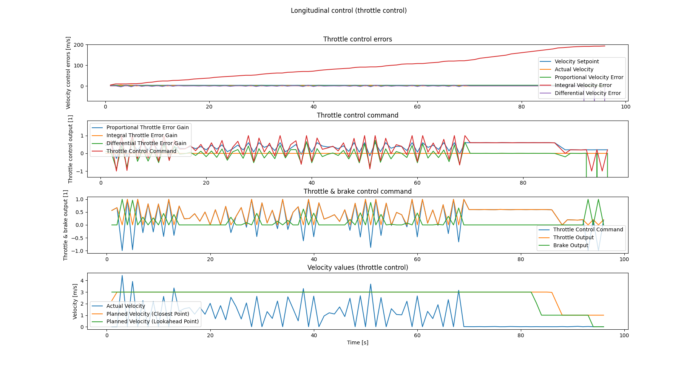](project/experiments/test_cte_02/figure_2_longitudinal_control_errors.png) | [](project/experiments/test_cte_02/figure_3_path_coordinates_of_actual_and_planned_trajectories.png) | [](project/experiments/test_cte_02/figure_4_actual_and_planned_trajectories.png) |
| 3 | [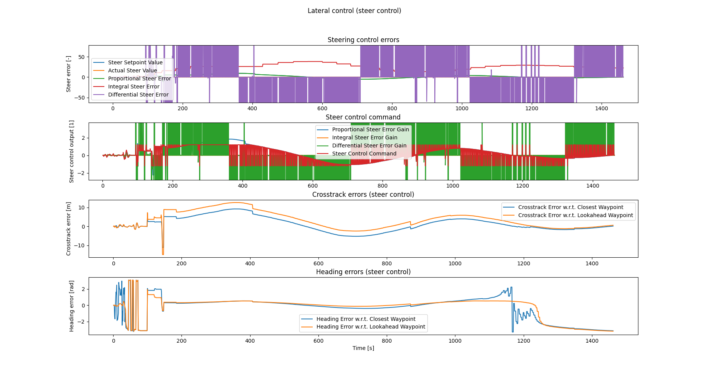](project/experiments/test_cte_03/figure_1_lateral_control_errors.png) |  [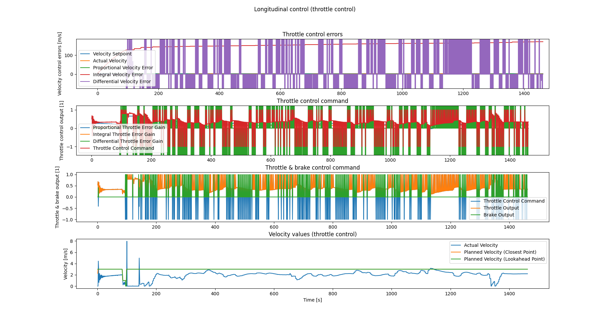](project/experiments/test_cte_03/figure_2_longitudinal_control_errors.png) | [](project/experiments/test_cte_03/figure_3_path_coordinates_of_actual_and_planned_trajectories.png) | [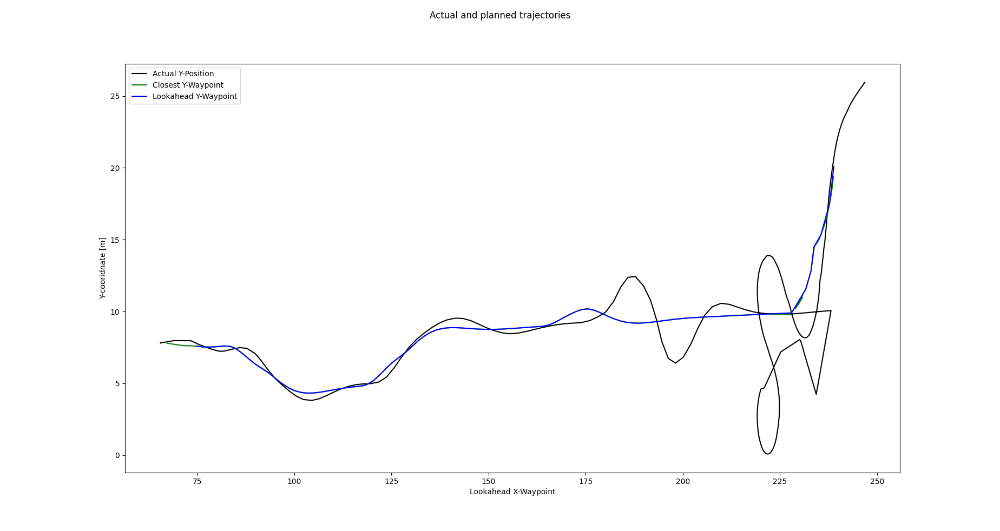](project/experiments/test_cte_03/figure_4_actual_and_planned_trajectories.png) |
| 4 | [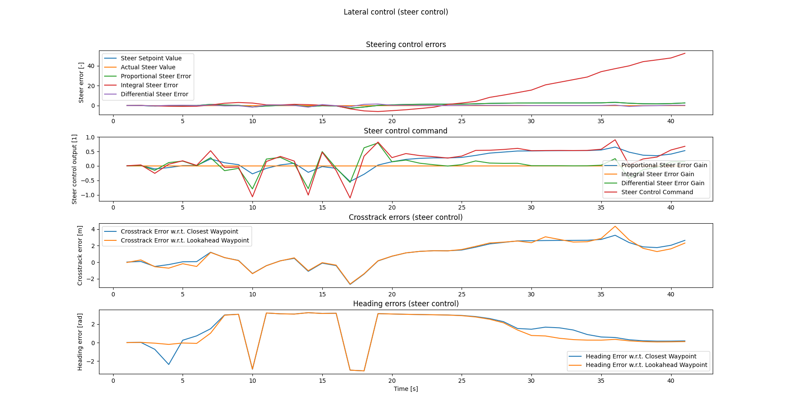](project/experiments/test_cte_04/figure_1_lateral_control_errors.png) |  [](project/experiments/test_cte_04/figure_2_longitudinal_control_errors.png) | [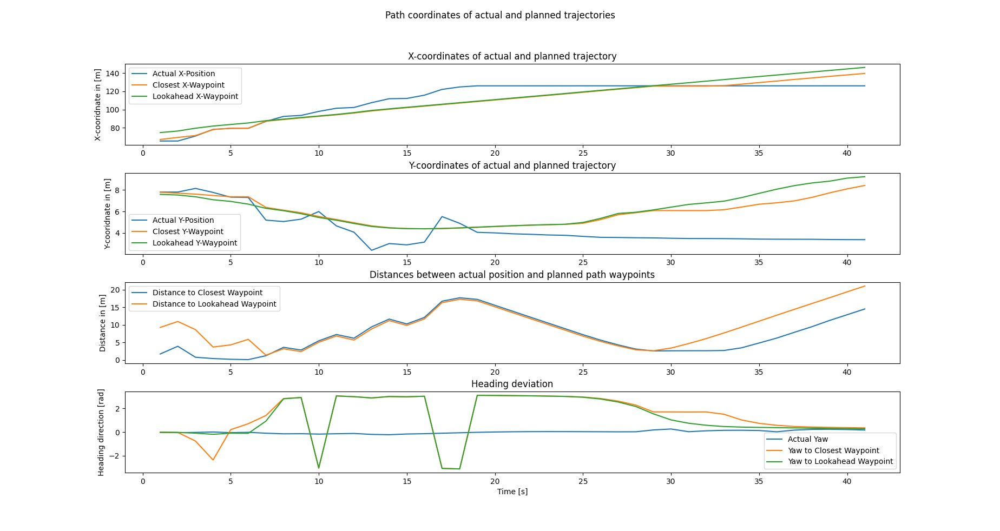](project/experiments/test_cte_04/figure_3_path_coordinates_of_actual_and_planned_trajectories.png) | [](project/experiments/test_cte_04/figure_4_actual_and_planned_trajectories.png) |
| 5 | [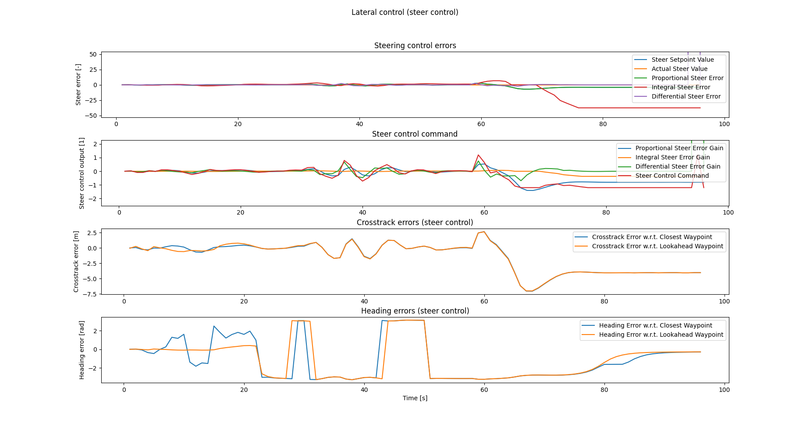](project/experiments/test_cte_05/figure_1_lateral_control_errors.png) |  [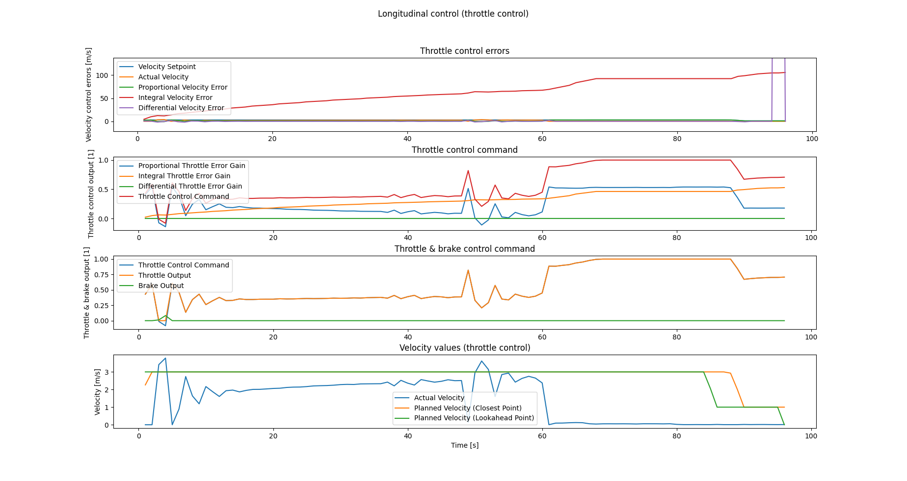](project/experiments/test_cte_05/figure_2_longitudinal_control_errors.png) | [](project/experiments/test_cte_05/figure_3_path_coordinates_of_actual_and_planned_trajectories.png) | [](project/experiments/test_cte_05/figure_4_actual_and_planned_trajectories.png) |
| 6 | [](project/experiments/test_cte_06/figure_1_lateral_control_errors.png) |  [](project/experiments/test_cte_06/figure_2_longitudinal_control_errors.png) | [](project/experiments/test_cte_06/figure_3_path_coordinates_of_actual_and_planned_trajectories.png) | [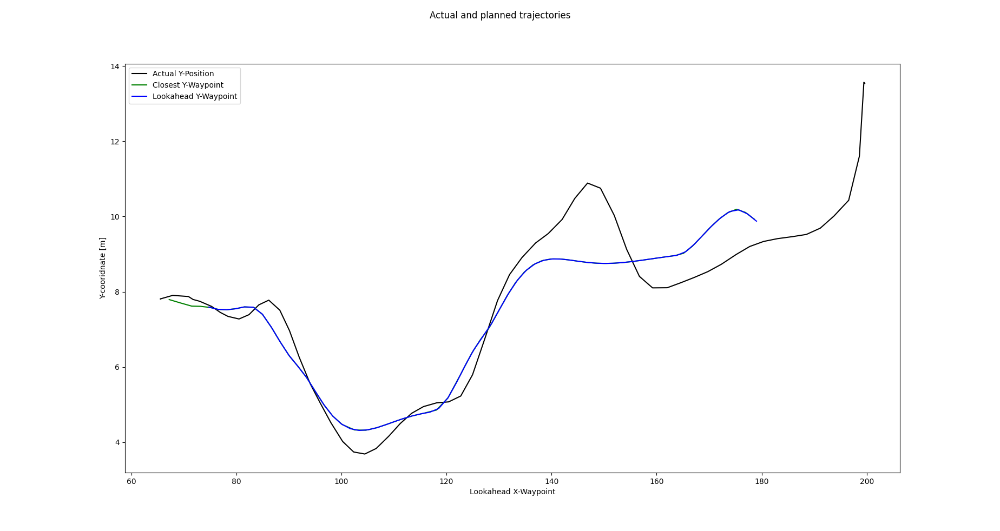](project/experiments/test_cte_06/figure_4_actual_and_planned_trajectories.png) |
| 7 | [](project/experiments/test_cte_07/figure_1_lateral_control_errors.png) |  [](project/experiments/test_cte_07/figure_2_longitudinal_control_errors.png) | [](project/experiments/test_cte_07/figure_3_path_coordinates_of_actual_and_planned_trajectories.png) | [](project/experiments/test_cte_07/figure_4_actual_and_planned_trajectories.png) |
| 8 | [](project/experiments/test_cte_08/figure_1_lateral_control_errors.png) |  [](project/experiments/test_cte_08/figure_2_longitudinal_control_errors.png) | [](project/experiments/test_cte_08/figure_3_path_coordinates_of_actual_and_planned_trajectories.png) | [](project/experiments/test_cte_08/figure_4_actual_and_planned_trajectories.png) |
| 9 | [](project/experiments/test_cte_09/figure_1_lateral_control_errors.png) |  [](project/experiments/test_cte_09/figure_2_longitudinal_control_errors.png) | [](project/experiments/test_cte_09/figure_3_path_coordinates_of_actual_and_planned_trajectories.png) | [](project/experiments/test_cte_09/figure_4_actual_and_planned_trajectories.png) |
| 10 | [](project/experiments/test_cte_10/figure_1_lateral_control_errors.png) |  [](project/experiments/test_cte_10/figure_2_longitudinal_control_errors.png) | [](project/experiments/test_cte_10/figure_3_path_coordinates_of_actual_and_planned_trajectories.png) | [](project/experiments/test_cte_10/figure_4_actual_and_planned_trajectories.png) |

*Table 1b: Results for PID steer and throttle control with parameters from table 1b using cross-track error for lateral control (using the closest waypoint to the ego vehicle's center position as setpoint for tests in tests 1 - 7 and an estimate of the ego vehicle's front axle position assuming a wheelbase of 4.0 m in tests 8 - 10)*

I have tried to set the parameter for the throttle control in a way such that the ego vehicle lacks behind the trajectory planner as long as possible. At the end of the road the ego vehicle usually overtakes the trajectory planner what makes everything instable. I wouldn't say that I could find a stable solution at all that would I would name somewhat satisfactory. Especially, the lateral PID control is prone to oszialltions and limit cycles. It easily gets instable and looses track - especially when there are sudden changes in path planning. In some cases this leads to situations where the ego vehicle drives a circle until it picks up track again to the runnaway path planner if it does not crash into an obstacle right away. 

#### Ways to automatically optimize PID control parameters

As lateral vehicle dynamics are non-linear and velocity dependent, we should actually consider to optimize control parameters over a larger desired speed range and a larger range of different steering maneuvers with smaller and larger steering amplitudes. We should define a test trajectory (or multiple test trajectories) to represent the whole target range of longitudinal and lateral control actions (e.g. driving curves with different curvature radii at different speeds). The ego vehicle should completely drive this test trajectory (these test trajectories) for all tested parameter constellations. The control errors over the whole test trajectory should be considered in a cost function, e.g. using the cumulative squared control error. Instable conditions (e.g. when the target vehicle looses track and leaves the road due to some instability) need to be filtered out as they cannot be evaluated properly.

Furthermore, it is not a good idea to tune parameters on a narrow track with obstacles as our controlled ego vehicle behavior can always become instable when testing different control parameters. Therefore, we should do the testing - at least the initial testing - on a large empty drivable space without any obstacles. Then chances to find back to track for situations with local instability might still be given.

A straight forward but maybe rather inefficient solution to optimize PID control parameters would be to raster pre-defined parameter ranges in a combinatorial sense using a brute-force approach. Still simple but more efficient than brute force approaches are "hill-climber" algorithms like the "twiddle" algorithm that was presented in the Udacity Self-Driving Car Engineer course. As small demo example will be added to this repo soon.

In any case, I would start testing control algorithms and parameter optimization not using CARLA simulator. I would rather start with a pre-optimization using simplified simulation of a 2D dynamic bicycle model of my ego vehicle with far less computational overhead and short simulation time for each iteration. In a second step it would then make sense to move over to a more detailed simulation to do the fine tuning, e.g. using CARLA with pre-optimized control parameters and a suitable pre-tested control algorithm design.

#### Final comments and remarks

During control parameter tuning it turned out that the behavior and trajectory planner in this simulation does not wait for the motion controller. It continues planning along an assumed path, which the ego vehicle motion control does not track any more if it looses its track or crashes into an obstacle, for example. This is not a suitable design of this simulation - especially not for the experiments in this project. As motion control can always get stuck or loose track, the behavior planner should not "run away" and proceed with its trajectory planning as if nothing happened. It should wait for the ego vehicle planning a new suitable trajectory starting from the actual vehicle location. Here I see some potential for improving this simulation setup.

## License

Remarks: Since the the code in this repository was build on the [starter code](https://github.com/udacity/nd013-c6-control-starter) provided by Udacity, it automatically falls under the Udacity license, too:

[LICENSE.md](./LICENSE.md)

This also applies to the changes, extensions or modifications implemented by the code owner, s. [CODEOWNERS](./CODEOWNERS).
